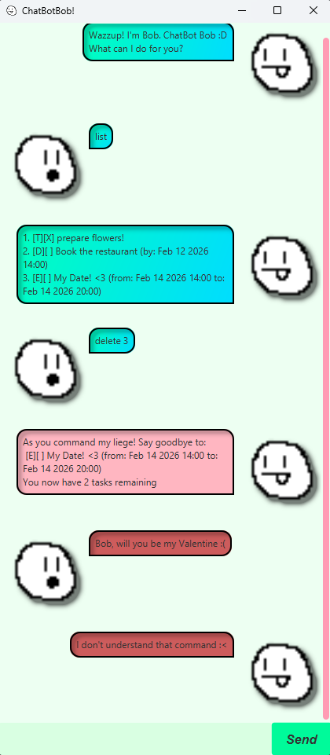

# ChatBotBob User Guide

ChatBotBob is a **desktop application that helps you manage tasks that you need to do**,
packaged in a nice minimalist UI :D

Modified from https://github.com/NUS-CS2103-AY2526-S2/ip as part of the CS2103T iP Submission

## Feature List
* [Adding Tasks `todo | deadline | event`](#adding-tasks)
* [Listing Tasks `list`](#listing-tasks)
* [Finding Tasks `find`](#finding-tasks)
* [Completing Tasks `mark | unmark`](#completing-tasks)
* [Deleting Tasks `delete`](#deleting-tasks)
* [Tagging Tasks `tag | tag-delete`](#tagging-tasks)
* [Closing the App `bye`](#closing-the-app)

## Adding Tasks
### Description:
Add tasks for Bob to keep track of! There are three types:

- Todo `todo <task-name>` (General Tasks with no set datetime)
- Deadline `deadline <task-name> /by <datetime>` (Tasks to be completed by a datetime)
- Event `event <task-name> /from <datetime> /to <datetime>` (Tasks that have a start datetime and end datetime)

> Note that `datetime` must be in the format: `YYYY-mm-dd HH:mm`

### Examples:
`todo Take a Hike`   Creates a Todo Task **named "Take a Hike"**  

`deadline Return Book /by 2020-04-02 10:00`  
Creates a Deadline Task **named "Return Book"** with a due datetime set to **2nd April 2020 10:00am**

`event Dance Party /from 2025-04-04 10:00 /to 2025-04-04 14:00`  
Creates an Event Task **named "Dance Party"** with a **start datetime 4th April 2025
10:00am** and **end datetime 4th April 2025 2:00pm**

## Listing Tasks
### Description:
List all tasks that has been added to Bob

Format: `list`

## Finding Tasks
### Description:
Search for a specific task via its name (case-insensitive).

Format `find <partial-task-name>`

### Examples:

If Bob has three tasks named:
- Le Le
- Test Wee
- Dee Tent

`find ee` Will retrieve **"Test Wee"** and **"Dee Tent"**

## Completing Tasks
### Description:
Mark a Task as completed.

Format: `mark <task-index>` 

> Note: You can find the task-index from either the [`list`](#listing-tasks) 
> or [`find`](#finding-tasks) command 

> You can also unmark Tasks that were mistakenly marked via `unmark <task-index>`

### Examples:
If Bob has three tasks added in the order:

1. Task 1
2. Task 2
3. Task 3

`mark 2` will mark Task 2 as complete, which can be confirmed via `list`.

## Deleting Tasks
### Description:
Delete a Task

Format: `delete <task-index>` 

### Example:
If Bob has three tasks added in the order:

1. Task 1
2. Task 2
3. Task 3

`delete 2` will delete **Task 2**, which can be confirmed via `list`. 
Task 3 will now be index 2.

## Tagging Tasks
### Description:
Add a Word Tag to a certain task, given a Task Index. You can tag a Task more than once

Format: `tag <task-index> <tag-name>`

If you would like to delete a tag...

Format: `tag-delete <task-index> <tag-name>`

> Note: Tag names should only be one word and certain punctuation, 
> such as `|` and `,` characters, are not allowed

### Example:
If Bob has three tasks added in the order:

1. Task 1
2. Task 2
3. Task 3

`tag 2 #TAGGED!` will tag **Task 2** with **#TAGGED!**. 

## Closing the App
### Description:
Closes the ChatBot Application and saves the tasks to file

`bye`
